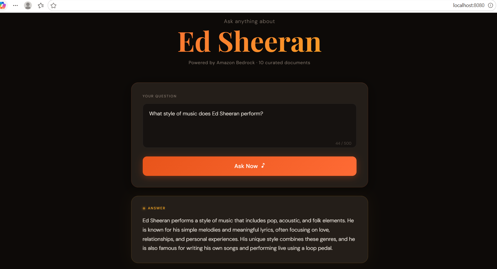
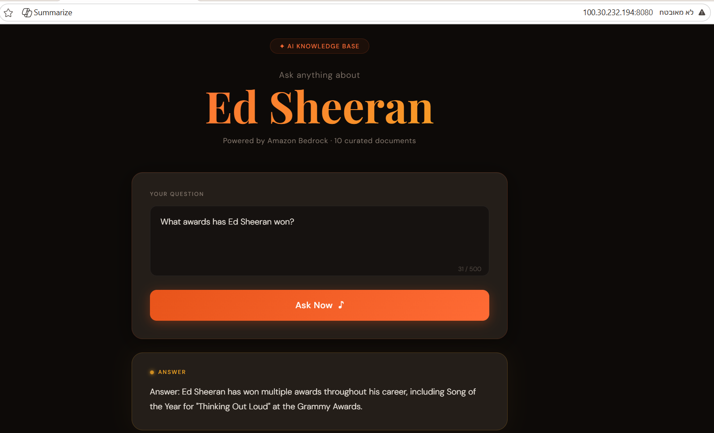

# 🎵 Ed Sheeran AI — Topic-Based RAG Web App

## Topic
**Ed Sheeran** — British singer-songwriter known for hits like Shape of You, Thinking Out Loud, and Perfect.

---

## Documents Used (10 documents)
1. `albums` — Studio Albums & Discography
2. `awards` — Grammy & BRIT Awards History
3. `biography` — Early Life & Personal Story
4. `collaborations` — Featured Artists & Collaborations
5. `fun_facts` — Interesting Facts about Ed Sheeran
6. `song_perfect_analysis` — Analysis of "Perfect"
7. `song_shape_of_you` — Analysis of "Shape of You"
8. `song_thinking_out_loud` — Analysis of "Thinking Out Loud"
9. `style_and_genre` — Music Style & Genre Influences
10. `top_songs` — Top Songs & Greatest Hits
---

## How the App Works

```
User Question
     ↓
Flask (app.py)
     ↓
boto3 → Amazon Bedrock retrieve_and_generate()
     ↓
Knowledge Base ID
     ↓
Answer displayed in browser
```

**Full Chain:**
documents → Bedrock Knowledge Base → Flask app with boto3 → Docker → EC2 → public access → cleanup

---

## Project Structure

```
flask_rag_project/
├── app.py                  # Flask entry point + boto3 connection
├── templates/
│   └── index.html          # UI with Ed Sheeran music theme
├── static/
│   └── css/
│       └── main.css        # Orange/dark design
├── data/                   # 10 documents about Ed Sheeran
├── requirements.txt
└── Dockerfile
```

---

## Public URL Used During Testing
```
http://100.30.232.194:8080
```

---

## AWS Resources Deleted After Testing
- ✅ EC2 Instance — Terminated
- ✅ Bedrock Knowledge Base — Deleted
- ✅ S3 Bucket (documents storage) — Deleted
- ✅ IAM Access Key — Deleted
- ✅ Security Group — Deleted

---

## Tech Stack
| Layer | Technology |
|-------|-----------|
| AI Model | Amazon Bedrock (Claude 3.5 Haiku) |
| RAG | Bedrock Knowledge Base |
| Backend | Python / Flask |
| AWS SDK | boto3 |
| Container | Docker |
| Registry | Docker Hub (hebaaq/ed-sheeran-app:0.0.1) |
| Hosting | AWS EC2 (Ubuntu) |

---

## Docker Commands Used
```bash
# Build
docker build -t ed-sheeran-app:0.0.1 .

# Push to Docker Hub
docker tag ed-sheeran-app:0.0.1 hebaaq/ed-sheeran-app:0.0.1
docker push hebaaq/ed-sheeran-app:0.0.1


# Run on EC2
docker run -p 8080:8080 -d --name ed-sheeran-app \
  -e AWS_ACCESS_KEY_ID=... \
  -e AWS_SECRET_ACCESS_KEY=... \
  -e AWS_DEFAULT_REGION=us-east-1 \
  hebaaq/ed-sheeran-app:0.0.1

## Screenshots




```
